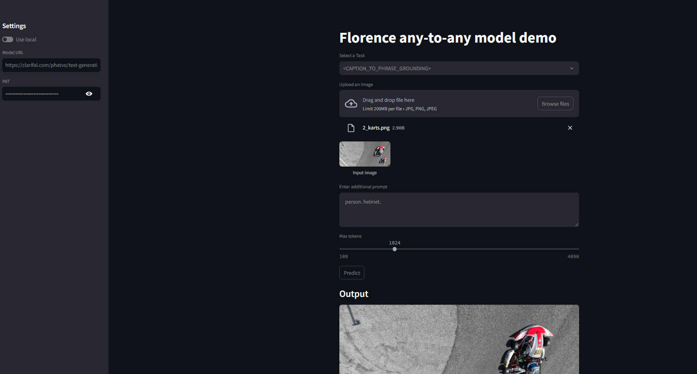

# How to deploy

1. Modify `config.yaml`

2. set CLARIFAI_PAT
```
export CLARIFAI_PAT="your pat"
```

3. Deploy
```
clarifai model upload --model_path ./florence2
```

# How to test

1. Using streamlit module. So first make sure you install streamlit==1.42.0
```
python -m pip install streamlit==1.42.0
```

2. Run 
```
streamlit run ./florence2/florence_streamlit_app.py
```


Note that ./florence2/florence_streamlit_app.py has no use in deployment, it's only used for demo.
